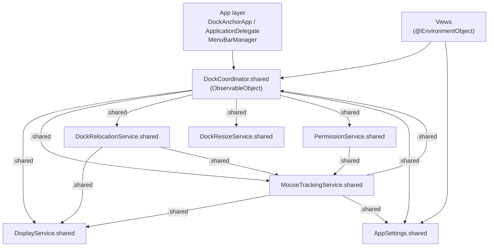

# Design: Class Architecture Refactor

## Problem Statement
The current codebase uses a single `DockMonitor` singleton with all logic distributed across `extension DockMonitor {}` files. There are no testable boundaries, and `ContentView.swift` (1007 lines) and `DockAnchorApp.swift` (668 lines) mix unrelated concerns. No individual file is organised around a single responsibility. Test coverage is minimal.

## Functional Requirements
- Same observable behaviour: mouse blocking, hot-corner preservation, dock relocation, 5-min position check, display profiles, resize/reposition
- All state accessible to SwiftUI views via `@EnvironmentObject` / `@StateObject`
- Each class uses `static let shared` singleton — no prop-drilling of service instances
- Services reference peers directly via `.shared` — no closure injection
- No individual method or function body exceeds 75 lines
- Files organised in hierarchical Xcode groups matching the new directory structure
- All main code paths covered by unit tests

## Non-Functional Requirements
- No behaviour changes — purely structural
- Build must pass with zero warnings added
- Existing `AppSettings` UserDefaults keys must be preserved

## Out of Scope
- UI design changes
- New user-facing features

## Constraints
- Technical: Swift 5.x, SwiftUI + AppKit, macOS 13+, no SPM packages
- Singleton lazy-init: Swift initialises `static let shared` on first access — no circular init problems provided services don't force-evaluate each other at `init()` time
- Testability: geometry/parse helpers are `internal` (not `private`) so `@testable import DockAnchor` exposes them in tests; system I/O methods remain `private`

---

## UI Designs
<!-- skipped: N/A — no visual changes -->

---

## Architecture Overview

### New Directory Structure

```
DockAnchor/ (main target group)
├── App/
│   ├── DockAnchorApp.swift           # @main, WindowGroup, commands
│   ├── ApplicationDelegate.swift     # app lifecycle — start monitoring, relocate on launch
│   ├── MenuBarManager.swift          # NSStatusItem + Combine-driven menu
│   └── WindowHiderDelegate.swift     # NSWindowDelegate close→hide
├── Models/
│   ├── DisplayInfo.swift             # DisplayInfo struct
│   ├── DockPosition.swift            # DockPosition enum
│   └── DockProfile.swift             # DockProfile Codable struct
├── Services/
│   ├── DisplayService.swift          # display enumeration + reconfiguration
│   ├── PermissionService.swift       # Accessibility TCC polling
│   ├── MouseTrackingService.swift    # CGEvent tap lifecycle + blocking logic
│   ├── DockRelocationService.swift   # synthetic-mouse relocation + dock detection
│   ├── DockResizeService.swift       # AppleScript position/size read-write
│   └── DockCoordinator.swift         # ObservableObject coordinator (replaces DockMonitor)
├── Settings/
│   └── AppSettings.swift             # UserDefaults persistence + profile management
└── Views/
    ├── Main/
    │   ├── ContentView.swift          # root composer — sheet state only (~50 lines)
    │   ├── StatusSection.swift        # status indicator + permission warning
    │   └── ControlsSection.swift      # start/stop + settings buttons
    ├── Display/
    │   ├── DisplayArrangementView.swift
    │   └── DisplayRectangleView.swift
    ├── Profiles/
    │   ├── ProfilesSection.swift      # profile list + add button
    │   ├── ProfileChip.swift
    │   ├── NewProfileSheet.swift
    │   └── EditProfileSheet.swift
    ├── DockSettings/
    │   └── DockSettingsSection.swift  # position picker + size slider + apply/reset
    ├── Settings/
    │   └── SettingsView.swift         # general settings sheet
    └── Shared/
        ├── CardStyle.swift
        └── WindowAccessor.swift
```

### Dependency Graph



> All `.shared` accesses are lazy — services only read peer state at call time, never at `init()` time.

---

## Component Breakdown

### DisplayService : ObservableObject
- **Singleton:** `static let shared = DisplayService()`
- **Owns state:** `@Published private(set) var displays: [DisplayInfo]`
- **Callbacks (set by DockCoordinator):** `var onDisplayAdded: ((DisplayInfo) -> Void)?`, `var onDisplayRemoved: ((CGDirectDisplayID) -> Void)?`, `var onLayoutChanged: (() -> Void)?`
- **Public API:**
  - `func display(forUUID: String) -> DisplayInfo?`
  - `func displayID(forUUID: String) -> CGDirectDisplayID?`
  - `func uuid(forDisplayID: CGDirectDisplayID) -> String?`
  - `func isAvailable(uuid: String) -> Bool`
  - `func canonicalUUID(matching: String) -> String?`
  - `static func fingerprint(for: CGDirectDisplayID) -> String`
  - `static func serialNumber(for: CGDirectDisplayID) -> UInt32?`
- **Internal (testable):** `func baseUUID(from: String) -> String`
- **Private:** `enumerate()`, `displayName(for:)`, `registerReconfigurationCallback()`, `handleReconfiguration(displayID:flags:)`, `onAdded(displayID:)`, `onRemoved()`, `onLayoutChanged()`

---

### PermissionService
- **Singleton:** `static let shared = PermissionService()`
- **Callbacks (set by DockCoordinator):** `var onRevoked: (() -> Void)?`
- **Public API:**
  - `func check() -> Bool`
  - `func prompt()`
  - `func openPreferences()`
  - `func startPolling(interval: TimeInterval)`
  - `func stopPolling()`
- **Private:** `poll()` — calls `check()` and `MouseTrackingService.shared.isEventTapValid()`

---

### MouseTrackingService
- **Singleton:** `static let shared = MouseTrackingService()`
- **Owns state:** `private(set) var isTracking: Bool`, `var eventTap: CFMachPort?`, `var runLoopSource: CFRunLoopSource?`
- **Peer access (lazy, at call time):**
  - `DockCoordinator.shared.anchorDisplayID`
  - `DockCoordinator.shared.dockPosition`
  - `DisplayService.shared.displays`
  - `AppSettings.shared`
- **Callbacks (set by DockCoordinator):** `var onHotCornerDetected: (() -> Void)?`, `var onStatusMessage: ((String) -> Void)?`
- **Public API:**
  - `func startTracking() -> Bool`
  - `func stopTracking()`
  - `func createTemporaryTap() -> Bool`
  - `func removeTemporaryTap()`
  - `func isEventTapValid() -> Bool`
- **Internal (testable):** `func triggerZone(for: DisplayInfo) -> CGRect`, `func cornerZones(for: DisplayInfo) -> [CGRect]`, `func isInCornerZone(_ location: CGPoint, display: DisplayInfo) -> Bool`, `func shouldBlock(at location: CGPoint) -> Bool`
- **Private:** `installEventTap()`, `handleMouseEvent(proxy:type:event:)`, `handleMouseMoved(_:)`

---

### DockRelocationService
- **Singleton:** `static let shared = DockRelocationService()`
- **Owns state:** `private(set) var isRelocating: Bool`
- **Peer access (lazy):** `DisplayService.shared.displays`, `MouseTrackingService.shared` (for temporary tap)
- **Callbacks (set by DockCoordinator):** `var onStatusMessage: ((String) -> Void)?`
- **Public API:**
  - `func relocate(to: DisplayInfo, dockPosition: DockPosition) async`
  - `func isDockOnDisplay(_ display: DisplayInfo, dockPosition: DockPosition) -> Bool`
- **Internal (testable):** `func subtractRanges(from: (CGFloat,CGFloat), subtract: [(CGFloat,CGFloat)]) -> [(CGFloat,CGFloat)]`, `func safeEdgeOffset(for: DisplayInfo, dockPosition: DockPosition) -> CGFloat`, `func triggerPoint(for: DisplayInfo, dockPosition: DockPosition) -> CGPoint`, `func pastEdgePoint(for: DisplayInfo, dockPosition: DockPosition) -> CGPoint`, `func clampedToScreenEdge(_ point: CGPoint, buffer: CGFloat) -> CGPoint`
- **Private:** `prepareEventTap()`, `sweepCursor(from:to:source:)`, `dwellAtEdge(_:source:)`, `restoreCursor(to:)`, `currentDockDisplayID(dockPosition:)`, `byVisibleFrame(dockPosition:)`, `byAccessibility()`

---

### DockResizeService
- **Singleton:** `static let shared = DockResizeService()`
- **Public API:**
  - `func setPosition(_ position: DockPosition) async`
  - `func setTileSize(_ pixels: Int) async`
  - `func currentPosition() -> DockPosition`
  - `func currentTileSize() -> Int`
- **Internal (testable):** `func parsePosition(_ raw: String) -> DockPosition`, `func parseTileSize(_ raw: String) -> Int`
- **Private:** `runAppleScript(_ source: String)`, `readDefaults(key: String) -> String`

---

### DockCoordinator : ObservableObject  *(replaces DockMonitor)*
- **Singleton:** `static let shared = DockCoordinator()`
- **Published state:** `isActive`, `statusMessage`, `anchoredDisplayName`, `needsPermissionReset`
- **Internal state:** `anchorDisplayUUID`, `dockPosition`, `positionCheckTimer`, `hotCornerWatchTimer`
- **Computed:** `var anchorDisplayID: CGDirectDisplayID`
- **Public API:** `startMonitoring()`, `stopMonitoring()`, `changeAnchorDisplay(toUUID:)`, `changeAnchorDisplay(to:)`, `relocateDock()`, `applyDockSettings(position:tileSize:)`
- **Private init wiring:** `setupCallbacks()` — sets `onDisplayAdded/Removed/LayoutChanged` on `DisplayService.shared`; sets `onHotCornerDetected/onStatusMessage` on `MouseTrackingService.shared`; sets `onStatusMessage` on `DockRelocationService.shared`; sets `onRevoked` on `PermissionService.shared`
- **Private:** `setupNotificationObservers()`, `startPositionCheckTimer()`, `stopPositionCheckTimer()`, `startHotCornerWatch()`, `stopHotCornerWatch()`, `handleDisplayAdded(_:)`, `handleDisplayRemoved(_:)`, `updateAnchoredDisplayName()`, `postStatus(_:resetAfter:)`, `applyDefaultAnchorIfNeeded()`

---

### ApplicationDelegate
Simplified — no composition root. Just lifecycle:
- Calls `DockCoordinator.shared.startMonitoring()` on launch (if permissions granted)
- Calls `DockCoordinator.shared.relocateDock()` on launch (if `autoRelocateDock`)
- Calls `UpdateChecker.shared.checkForUpdates()` after delay
- Calls `MenuBarManager.shared.setup()` on launch

---

## State Management
- **Global (coordinator):** `DockCoordinator.shared` — monitoring state, status, anchor name, permission flag
- **Global (settings):** `AppSettings.shared` — persisted preferences, profiles, UUIDs
- **Service-local:** `isTracking`, `isRelocating` — never surfaced to views; coordinator publishes what matters
- **View-local:** sheet booleans, form field states, `liveDockPosition`, `liveDockTileSize`

---

## Data Models

### DisplayInfo  (`Models/DisplayInfo.swift`)
```json
{ "id": "CGDirectDisplayID", "uuid": "String", "serialNumber": "UInt32?", "frame": "CGRect", "name": "String", "isPrimary": "Bool" }
```

### DockPosition  (`Models/DockPosition.swift`)
```json
{ "rawValue": "left | bottom | right" }
```

### DockProfile  (`Models/DockProfile.swift`)
```json
{ "id": "UUID", "name": "String", "anchorDisplayUUID": "String", "createdAt": "Date", "autoActivate": "Bool", "dockPosition": "DockPosition?", "dockTileSize": "Int?" }
```

---

## Testing

Tests live in `DockAnchorTests/` organised to mirror the main target:

```
DockAnchorTests/
├── Services/
│   ├── DisplayServiceTests.swift
│   ├── DockRelocationServiceTests.swift
│   ├── MouseTrackingServiceTests.swift
│   └── DockResizeServiceTests.swift
├── Settings/
│   └── AppSettingsTests.swift
└── Models/
    └── DockProfileTests.swift
```

### DisplayServiceTests
| Test | Method under test | Assertion |
|------|------------------|-----------|
| `testBaseUUID_stripsSerialSuffix` | `baseUUID(from:)` | `"ABC-SN123"` → `"ABC"` |
| `testBaseUUID_stripsVendorSuffix` | `baseUUID(from:)` | `"ABC-V1M2"` → `"ABC"` |
| `testBaseUUID_unchanged` | `baseUUID(from:)` | `"ABC"` → `"ABC"` |
| `testIsAvailable_exactMatch` | `isAvailable(uuid:)` | returns true when UUID in displays |
| `testIsAvailable_baseMatch` | `isAvailable(uuid:)` | matches via stripped UUID |
| `testIsAvailable_noMatch` | `isAvailable(uuid:)` | returns false for unknown UUID |
| `testCanonicalUUID_exactMatch` | `canonicalUUID(matching:)` | returns exact UUID |
| `testCanonicalUUID_baseMatch` | `canonicalUUID(matching:)` | returns canonical form via base UUID |

### DockRelocationServiceTests
| Test | Method under test | Assertion |
|------|------------------|-----------|
| `testSubtractRanges_noOverlap` | `subtractRanges` | full range returned |
| `testSubtractRanges_partialLeft` | `subtractRanges` | trimmed correctly |
| `testSubtractRanges_partialRight` | `subtractRanges` | trimmed correctly |
| `testSubtractRanges_fullCoverage` | `subtractRanges` | empty result |
| `testSubtractRanges_multipleSegments` | `subtractRanges` | two free segments returned |
| `testSafeEdgeOffset_noAdjacentDisplays` | `safeEdgeOffset` | returns midpoint of full range |
| `testSafeEdgeOffset_adjacentDisplay` | `safeEdgeOffset` | midpoint excludes shared boundary |
| `testTriggerPoint_bottom` | `triggerPoint` | y = frame.maxY - 1 |
| `testTriggerPoint_left` | `triggerPoint` | x = frame.minX + 1 |
| `testTriggerPoint_right` | `triggerPoint` | x = frame.maxX - 1 |
| `testPastEdgePoint_bottom` | `pastEdgePoint` | y = frame.maxY + 20 |
| `testClampedToScreenEdge_insideDisplay` | `clampedToScreenEdge` | clamped within bounds |

### MouseTrackingServiceTests
| Test | Method under test | Assertion |
|------|------------------|-----------|
| `testTriggerZone_bottom` | `triggerZone(for:)` | rect at bottom edge, height = 10 |
| `testTriggerZone_left` | `triggerZone(for:)` | rect at left edge, width = 10 |
| `testTriggerZone_right` | `triggerZone(for:)` | rect at right edge, width = 10 |
| `testCornerZones_bottom` | `cornerZones(for:)` | 2 rects at bottom-left and bottom-right |
| `testCornerZones_left` | `cornerZones(for:)` | 2 rects at top-left and bottom-left |
| `testIsInCornerZone_true` | `isInCornerZone` | point in corner zone → true |
| `testIsInCornerZone_false` | `isInCornerZone` | point in centre → false |

### DockResizeServiceTests
| Test | Method under test | Assertion |
|------|------------------|-----------|
| `testParsePosition_bottom` | `parsePosition` | `"bottom"` → `.bottom` |
| `testParsePosition_left` | `parsePosition` | `"left"` → `.left` |
| `testParsePosition_right` | `parsePosition` | `"right"` → `.right` |
| `testParsePosition_unknown` | `parsePosition` | unknown string → `.bottom` (default) |
| `testParseTileSize_valid` | `parseTileSize` | `"48"` → `48` |
| `testParseTileSize_malformed` | `parseTileSize` | `"abc"` → `48` (default) |

### AppSettingsTests
| Test | Method under test | Assertion |
|------|------------------|-----------|
| `testFindAutoActivate_exactMatch` | `findAutoActivateProfile` | returns profile with exact UUID |
| `testFindAutoActivate_baseMatch` | `findAutoActivateProfile` | returns profile via stripped UUID |
| `testFindAutoActivate_noMatch` | `findAutoActivateProfile` | returns nil |
| `testProfileCRUD_create` | `createProfile` | appended to profiles array |
| `testProfileCRUD_update` | `updateProfile` | replaces by id |
| `testProfileCRUD_delete` | `deleteProfile` | removed from array; activeProfileID cleared if active |
| `testExtractBaseUUID_SN` | `extractBaseUUID` | strips -SN suffix |
| `testExtractBaseUUID_V` | `extractBaseUUID` | strips -V suffix |

### DockProfileTests
| Test | Assertion |
|------|-----------|
| `testCodableRoundTrip_allFields` | encode → decode preserves all fields |
| `testCodableRoundTrip_nilOptionals` | encode → decode with nil position/tileSize |
| `testDecoderMigration_missingAutoActivate` | decodes legacy JSON without `autoActivate` → defaults false |

---

## Implementation Phases

**Phase 1: Extract Models** `[Phase total: ~4k tokens]` ✅
- ☑ [Sequential] 1a — `Models/DockPosition.swift` from `DisplayTypes.swift` `[~1k tokens]`
- ☑ [Sequential] 1b — `Models/DisplayInfo.swift` from `DisplayTypes.swift`; remove `DisplayTypes.swift` `[~1k tokens]`
- ☑ [Sequential] 1c — `Models/DockProfile.swift` from `AppSettings.swift`; update `AppSettings.swift` `[~2k tokens]`
- **Testable when:** project builds cleanly ✅

**Phase 2: Service layer** `[Phase total: ~45k tokens]`
- ☑ [Parallel] 2a — `Services/DisplayService.swift` — singleton, `@Published displays`, CGDisplay callback, enumerate/name/fingerprint, `internal baseUUID`. Remove `DisplayIdentifier.swift`, `DisplayManager.swift`, `DisplayTypes.swift` `[~12k tokens]`
- ☑ [Parallel] 2b — `Services/PermissionService.swift` — singleton; remove `PermissionManager.swift` `[~5k tokens]`
- ☑ [Parallel] 2c — `Services/DockResizeService.swift` — singleton, `internal parsePosition/parseTileSize`; remove `DockResizer.swift` `[~5k tokens]`
- ☑ [Sequential] 2d — `Services/DockRelocationService.swift` — singleton; uses `DisplayService.shared`; all geometry helpers `internal`; remove `DockRelocator.swift` `[~14k tokens]`
- ☑ [Sequential] 2e — `Services/MouseTrackingService.swift` — singleton; reads `DockCoordinator.shared`/`DisplayService.shared`/`AppSettings.shared` lazily; geometry helpers `internal`; remove `MouseEventHandler.swift` `[~9k tokens]`
- **Testable when:** project builds cleanly; `DockMonitor.swift` still exists; extension files gone

**Phase 3: DockCoordinator** `[Phase total: ~15k tokens]`
- ☐ [Sequential] 3a — `Services/DockCoordinator.swift` — singleton; published properties; `setupCallbacks()` wires all service callbacks; public API methods; timers `[~10k tokens]`
- ☐ [Sequential] 3b — Update `ApplicationDelegate` to call `DockCoordinator.shared` lifecycle methods; remove `DockMonitor.swift` `[~5k tokens]`
- **Testable when:** app launches, menu bar icon appears, Start Protection works

**Phase 4: View decomposition** `[Phase total: ~30k tokens]`
- ☐ [Parallel] 4a — `Views/Shared/CardStyle.swift`, `Views/Shared/WindowAccessor.swift` `[~2k tokens]`
- ☐ [Parallel] 4b — `Views/Display/DisplayArrangementView.swift`, `Views/Display/DisplayRectangleView.swift` `[~5k tokens]`
- ☐ [Parallel] 4c — `Views/Profiles/ProfileChip.swift`, `Views/Profiles/NewProfileSheet.swift`, `Views/Profiles/EditProfileSheet.swift` `[~8k tokens]`
- ☐ [Sequential] 4d — `Views/Profiles/ProfilesSection.swift`, `Views/Main/StatusSection.swift`, `Views/Main/ControlsSection.swift`, `Views/DockSettings/DockSettingsSection.swift` `[~10k tokens]`
- ☐ [Sequential] 4e — `Views/Settings/SettingsView.swift`; slim `ContentView.swift` to ≤ 60 lines `[~5k tokens]`
- **Testable when:** app builds; all panels visible; no layout regressions

**Phase 5: App layer cleanup** `[Phase total: ~18k tokens]`
- ☐ [Sequential] 5a — `App/WindowHiderDelegate.swift`, `App/WindowAccessor.swift` from `DockAnchorApp.swift` `[~3k tokens]`
- ☐ [Sequential] 5b — `App/MenuBarManager.swift` — singleton; split `setupStatusMenu` into `buildMenu()`, `buildDisplaySubmenu()`, `buildProfilesSubmenu()`, `buildThemeSubmenu()`, `bindPublishers()` each ≤ 75 lines `[~10k tokens]`
- ☐ [Sequential] 5c — `App/ApplicationDelegate.swift`; slim `DockAnchorApp.swift` to scene + commands only `[~5k tokens]`
- **Testable when:** menu bar fully functional; all Combine subscriptions live

**Phase 6: Test suite** `[Phase total: ~20k tokens]`
- ☐ [Parallel] 6a — `DockAnchorTests/Services/DisplayServiceTests.swift` — all 8 cases from Testing table `[~4k tokens]`
- ☐ [Parallel] 6b — `DockAnchorTests/Services/DockRelocationServiceTests.swift` — all 12 cases `[~6k tokens]`
- ☐ [Parallel] 6c — `DockAnchorTests/Services/MouseTrackingServiceTests.swift` — all 7 cases `[~4k tokens]`
- ☐ [Parallel] 6d — `DockAnchorTests/Services/DockResizeServiceTests.swift` — all 6 cases `[~2k tokens]`
- ☐ [Parallel] 6e — `DockAnchorTests/Settings/AppSettingsTests.swift` — all 8 cases `[~3k tokens]`
- ☐ [Parallel] 6f — `DockAnchorTests/Models/DockProfileTests.swift` — all 3 cases `[~1k tokens]`
- **Testable when:** `cmd+U` passes all tests

---

## Changelog
- Replaced constructor injection with `static let shared` singleton pattern; services reference peers lazily via `.shared` at call time — no prop drilling
- Removed composition root from `ApplicationDelegate`; `ApplicationDelegate` reduced to lifecycle calls only
- Removed closure provider pattern from `MouseTrackingService` (no `anchorDisplayIDProvider` closures)
- `PermissionService.poll()` reads tap validity via `MouseTrackingService.shared.isEventTapValid()` directly
- Expanded Testing section: 44 named test cases across 6 files, each mapped to the specific `internal` method under test
- Added Phase 6 (test suite) as a dedicated parallel phase
- Removed "Test coverage improvements (existing test files unchanged)" from Out of Scope
